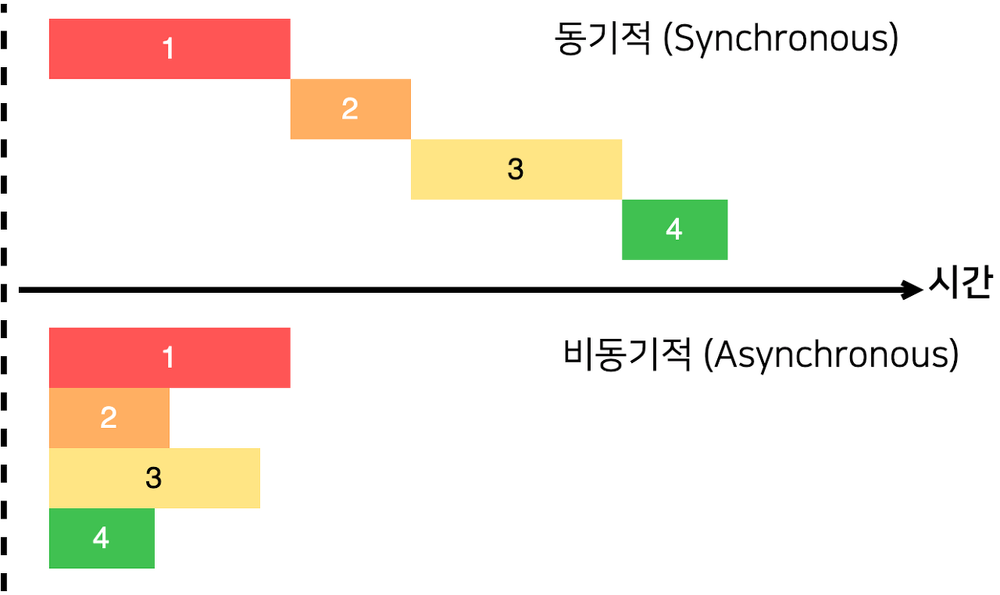
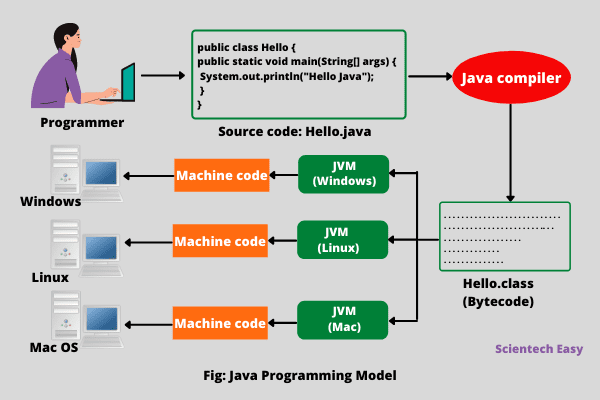

# Quiz on Chapter 1

Question 1:

One of the components of a computer is its CPU. What is a CPU and what role does it play in a computer?

Answer :
CPU(Central Processing Unit)

- ALU (Arithmetic Logical Unit)  
  산술 논리 장치, 덧셈, 뺄셈(-,+) 같은 두 숫자의 산술 연산(AND,OR,NOT,XOR,)과 논리 연산을 계산  
  계산을 하기 위해서는 연산과 피 연산자가 필요하다. 레지스터를 통해 피 연산자 (DATA)를 받아들이고, 제어장치로부터 수행할 연산을 알려주는 제어신호를 받아들인다.
  내보내는 값은 숫자, 문자, 특정 메모리 주소가 될수 있고, 이 정보는 곧바로 메모리로 저장되는 것이 아니라 레지스터에 저장된다.
- Register  
  cpu의 연산속도는 매우 빠르기 때문에 연산 하고자 하는 데이터와 명령어가 미리 모여있는 장소이다  
  (fetch)-> 메모리에서 cpu로 데이터를 끌어올리는일
  데이터를 저장하는 공간 (Flip Flop의 집합)

      >flipflop?
      논리회로에 필수적으로 들어가는 1비트 저장회로, 0과 1 두가지 상태를 저장한다.(SR,JK,D,T) 이전상태를 저장하며 두가지, 혹은 한가지 입력을 통해 출력을 제어할수 있다. (0,1)

  > Cache? 캐쉬는 cpu와 주기억 장치 사이에 존재하며, 명령어와 데이터를 갖고있다는 공통점이 있지만 Cashe는 메인 메모리와 cpu의 연산 딜레이를 최소화 하기 위해 자주 사용하는 데이터를 미리 복사해 놓은 임시 저장 장소를 의미한다. (Write-Back)
  > 데이터를 저장하는 공간 (Flip Flop의 집합)

- CU(Control Unit)
  레지스터에서 가져온 명령어가 ALU에서 읽힐수 있도록 처리 , 및 명령어의 순서를 지정하는 유닛

### Question 2:

Explain what is meant by an "asynchronous event." Give some examples.

#### Answer :

> 동기식은 송신과 수신측이 데이터를 주고 받기전, 수신 신호와 송신신호를 주고받은후 데이터를 주고 받는 일종의 루틴이 있는 데이터 전송 방법이다. 비동기식은 수신측의 수신신호 없이 송신신호와 데이터를 바로 보내는 방식이다.

#### 동기식 synchronous (transmission)

> 동기식 전송은 한 문자 단위가 아니라 미리 정해진 수 만큼의 문자열을 한 묶음으로 만들어서 일시에 전송하는 방법이다. 이 방법에서는 데이터와는 별도로 송신측과 수신측이 하나의 기준 클록으로 동기신호를 맞추어 동작한다. 수신측에서는 클록에 의해 비트를 구별하게 되므로, 동기식 전송을 위해서는 데이터와 클록을 위한 2회선이 필요하다. 송신측에서 2진 데이터들을 정상적인 속도로 내 보내면, 수신측에서는 클록의 한 사이클 간격으로 데이터를 인식하는 것이다.

### 비동기식 asynchronous (transmission)

> 에디터 내에 동기신호를 포함시켜 데이터를 전송한다. 송신측의 송신 클록에 관계없이 수신신호 클록으로 타임 슬롯의 간격을 식별하여 한번에 한 문자씩 송수신한다.  
> 이때 문자는 7~8 비트로 구성되며, 문자의 앞에 시작비트 (start bit)를, 끝에는 정지비트 (stop bit)를 첨가해서 보내는 방법이다.  
> 비동기식 전송은 시작비트와 정지비트 사이의 간격이 가변적이므로 불규칙적인 전송에 적합하다. 또한 필요한 접속장치와 기기들이 간단하므로 동기식전송 장비보다 값이 싸다는 장점이 있다.

[https://jajubogi.tistory.com/14]  
[https://tlsdnjs12.tistory.com/12] 어려워서 다시공부

## Question 3:

What is the difference between a "compiler" and an "interpreter"?

#### Answer :

컴파일러는 사람이 읽을수 있는 high-level programming language를 기계가 읽을수 있는 기계어로 바꿔주는 역할을 한다. 인터프리터 또한 기계어로 바꾸어 줄수 있지만 출력하는 방법이 조금 다르다. 컴파일러는 소스코드 전체를 컴퓨터 프로세서가 바로 실행할수 있도록 바로 기계어로 변환해 주지만, 인터프리터는 고레벨 언어를 중간 코드로 변환하고, 이를 각 행마다 실행한다.

### Question 4:

Explain the difference between high-level languages and machine language.

#### Answer :

인간이 보기 편한 언어는 기계가 읽을수 없다. 기계는 0과 1만을 읽을 수 있기 때문에 이를 번역해 주는 과정이 필요한 것이다. 인간이 읽을수 있는 언어가 high-level language(java, python ...)과 같은 언어이고 machine language는 binary code 이다.

### Question 5:

If you have the source code for a Java program, and you want to run that program, you will need both a compiler and an interpreter. What does the Java compiler do, and what does the Java interpreter do?

#### Answer:

자바는 왜 jvm를 통해 컴파일과 인터프리터를 두번 하는가?

컴파일러는 기계어로 바로 바꿀수 있지만, os가 바뀌면 컴파일하는 방식도 바꿔주어야한다. 따라서 jvm라는 가상의 컴퓨터를 만들고 jvm이 해석할수 있는 자바 바이너리 코드로 변환해준다. 이를 각 os에 맞게 인터프리팅 해주면 다양한 컴퓨터에서 같은코드로 jvm만 os에 맞게 설치하면 구동이 가능하도록 할수 있는 것이다.

### Question 6:

What is a subroutine?

#### Answer :

    modifiers  return-type  subroutine-name  ( parameter-list ) {
    statements
    }

컴퓨터 프로그래밍에서 루틴과 서브 루틴은 어떤 프로그램이 실행될 때 불려지거나 반복해서 사용되도록 만들어진 일련의 코드들을 지칭하는 용어이다

### Question 7:

Java is an object-oriented programming language. What is an object?

#### Answer :

(Object Oriented Programming Language)
객체지향 프로그래밍이란? : 컴퓨터 프로그래밍 패러다임중 하나로 프로그래밍에서 필요한 데이터를 추상화시켜 상태와 행위를 가진 객체를 만들고, 그 객체들 간의 유기적인 상호작용을 통해 로직을 구성하는 프로그래밍 방법.

객체란 ?(Instance)
클래스에서 정의한 변수와 메서드를 토대로 실제 메모리에 할당한것.
[https://jeong-pro.tistory.com/95] -> 다시볼것

### Question 8:

What is a variable? (There are four different ideas associated with variables in Java. Try to mention all four aspects in your answer. Hint: One of the aspects is the variable's name.)

#### Answer :

    int a = 1;

int 는 identifier로서 식별자이다, 들어오는 데이터가 Integer인지 String인지 구분하고 할당할 메모리의 크기를 결정한다,
a 는 데이터의 이름이다. 데이터를 메모리에 저장한후, 메모리 어디에 저장이 되었는지 주소의 별명이다. 1은 data이다

### Question 9:

Java is a "platform-independent language." What does this mean?

#### Answer :

자바가 플랫폼(os)에 독립된 언어라는 뜻은 jvm을 통해 모든 high-level language가 java binarycode로 바뀌고 jvm을 os에 따라 맞춰주기만 하면 모든 platform에서 작성한 자바 코드가 작동할수 있기 때문이다.

### Question 10:

What is the "Internet"? Give some examples of how it is used. (What kind of services does it provide?)

#### Answer :

여러 컴퓨터가 각각 클라이언트와 서버가 되어 서로 연결되어 망을 구성하는 컴퓨터 네트워크
