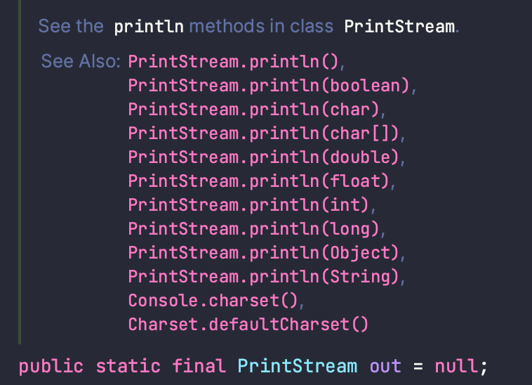

Question 1:

A "black box" has an interface and an implementation. Explain what is meant by the terms interface and implementation.

Answer :
블랙박스라는건 내부를 볼수 없는 상자라는 뜻이다. 정확히 말하자면, 내부를 볼 필요가 없다는 뜻이다. 예를 들어 사용자가 tv전원을 켠다 라고 치면
tv를 구매한 사용자가 tv를 켜는 입력을 가하면 tv 안에서 어떤원리로 인해 전원이 켜지는지 알 필요가 없다는 뜻이다. 사용자는 tv에 있는 가장 큰 버튼이
전원을 켜고 끌수 있는 스위치라는것만 알면 된다는 것이다. 사용자가 전선을 직접 연결해서 사용하지 않는 것처럼, 우리는 인터페이스(tv의 리모컨)를 사용자가 알기
쉽고, 사용하기 쉽게 만들 필요가 있다. 이는 보안과도 관련이 있는데, 특별한 기술이 들어간 tv라고 한다면, 회사 입장에서 사용자가 이 원리에 대해서 알아서 좋을것이 없을것이다.
이렇게 좋은 tv 구나 정도만 annotation해주면 좋을것이다.

Question 2:

A subroutine is said to have a contract. What is meant by the contract of a subroutine? When you want to use a subroutine, why is it important to understand its contract? The contract has both "syntactic" and "semantic" aspects. What is the syntactic aspect? What is the semantic aspect?

Answer :

서브 루틴이란, 하나의 출력을 위해 일련의 작업들이 있어야 하는것의 묶음을 말한다. 클래스 안에 흔히 쓰는

    public static void main(){}

을 살펴보자, 여기에서 public으로 먼저 정의를 해줘 이 서브루틴이 호출될수 있는 범위를 먼저 선언해주고, static이라는 선언을 통해, 이 서브루틴이 객체없이 동작할수 있는지,
아니면 객체를 통해 호출해야하는지 선언해주고, 실행한 이후 출력값의 형태가 있는지 없는지, 있다면 어떤 형태인지 선언하고,안에 들어가는 파라미터를 넣어주고,중괄호에 들어가는
여러 수식으로 어떤 결과를 출력할것인지 선언한다. 이 모든 일련의 과정은 반드시 필요하다. 선언이 되어 있지 않은 서브루틴도 있지만 이는 디폴트값으로 선언된 것이므로
서브루틴에 포함이 되지 않는다 라고 말하기 어렵고, 한국어 번역은 일련의 과정이라고 하지만, 영어의 뜻처럼 하나의 루틴정도라 생각하면 좋다.
이 과정에서 루틴에 반드시 선언해야 하는 내용을 선언하지 않으면 우리는 문법이 틀렸다 말한다. 영어에도 말하는 순서가 있는것처럼, 서브루틴에도 순서가 있고, 문법이 있는것이다.
단어가 틀리거나 서브루틴의 순서가 틀리면 문법이 틀린 것이므로 컴퓨터(native)는 이해하지 못한다. 이를 우리는 신택틱 에러라 말하며, 세멘틱 에러는 문법적으로 문제는 없으나
기능에 문제가 있는경우이다. 예를 들어 나는 더하기를 하고싶은데 곱하기를 한 연산이 출력 된다면, 이는 잘 못된 것이다. 컴퓨터는 이 말을 이해할수 있으나, 제 기능을
수행하지 못한다. 따라서 오류도 검출되지 않기때문에 우리는 이 에러를 디버그를 통해서 잡아야 한다.

Question 3:

Briefly explain how subroutines can be useful in the top-down design of programs.

Answer : 서브루틴한다는 것은 일련의 과정을 하나로 묶어서 사용한다는 뜻인다. 루틴이 없는 기능들을 한줄한줄 모두 출력을 하게 된다면 코드는 눈뜨고 볼수 없을만큼
길어지게 될것이다. 따라서 하나의 과정을 작게 묶어서 다음에 조금의 기능을 추가하거나, 조금의 파라미터만 건들여서 바꿀수 있는 부분이 있다면 바꿔서 할수있다는 점이
탑타운 디자인 프로그램(탑다운 방식이란? plan and implementation 방식으로서 , 프로그램에 대한 전반적인 설계를 먼저 구체적으로 하고, 이를 모듈별로 나누어
구현하는 방식,처음설계한방식이 들어맞는 경우는 거의 없기때문에 계획이 수정되면서 구현이 계속 변화해야 한다) / 바텀업?(단순히 제작을 거꾸로 하는것이 아니라.
프로그램 언어와 목표하는 프로그램의 유기적인 상호관계를 바탕으로 재사용 가능한 코드를 생산하는 것)에서 작게 작게 나누는데 많은 도움이 된다.
바텀업도 알아보면서 생각해보니 바텀업에도 도움이 된다. 맞나?

Question 4:

Discuss the concept of parameters. What are parameters for? What is the difference between formal parameters and actual parameters?

Answer : 파라미터란 메소드에 입력인자로 받는칸에 들어가는 변수를 의미한다. 이를 통해 우리는 메소드(=서브루틴,블랙박스...)를 조작할수 있다. 파라미터를 굳이 나누자면
포말 파라미터(폼만 있는거)와 액추얼 파라미터(실제 값이 있는것)로 나눌수 있는데 우리가

    public void isEven(int value) 와 isEven(5)에 파라미터는 이름은 파라미터로 같지만 안에 들어있는 값은 다르다.

int value 라는것은 들어올수 있는값이 integer 형이고 메소드내에서 사용할 이름이 value라는 뜻이다, 5는 앞으로 사용할 메소드에 들어가는 파라미터를 5로 해달라는
뜻이다. 전자는 foraml 후자는 actual이다

Question 5:

Give two different reasons for using named constants (declared with the final modifier).

Answer : 상수는 FINAL이라는 식별자를 넣어서 구분 가능하다. 상수라는 뜻 그대로 final 키워드를 붙히는 순간 값은 변화하지 못한다.
이것을 사용하는 이유는 뭘까? 바로 여러곳에서 사용해야하는 값인 경우이다. 계산기를 구현한다고 쳐보면 3.14같은 불변하는 수는 존재할것이며, 수식등에도 많이 포함
될것이다. 정확하면 정확할수록 계산기의 퀄리티가 올라갈 것이므로 설계자는 3.141592...등과 같이 최대한 오차가 없도록 만들고 싶어할것이다.
설계자가 식을 만드는 도중 실수로 3.141592...가 바뀌었다고 하면 어떻게 될까? 단순히 데이터만 바뀌면은 문법적으로는 오류도 나지 않기 때문에 찾기가 매우
힘들것이다. 파이를 넣는곳이 한두곳인가? 이를 위해 설계자는 전역변수로 파이를 상수로 그냥 설정해 버렸다. 이렇게 전역변수로 만들어버리면, 클래스 내 모든 수식들이
파이를 가져다가 쓸수 있게 된 것이다. 또 한가지 장점은, 파이의 값이 갑자기 대단한 수학자의 발견으로 원주율이 바뀌었다고 생각해보자. 계산기 제작자들은 눈물을 흘린다.
"원주율 언제 또 갖다 바꾸냐.." 원주율이 바뀔것을 예상한 현명한 개발자는 웃으면서 상수 하나만 바꾼다.

Question 6:

What is an API? Give an example.

Answer :
API(Application Programming Interface) 응용 프로그램 프로그래밍 인터페이스 : 응용 프로그램에서 사용할 수 있도록, 운영 체제나 프로그래밍 언어가
제공하는 기능을 제어할 수 있게 만든 인터페이스를 뜻한다.

라고 사전적 정의는 되어있다. 뭔말인지 모르겠으니까 쉽게 설명하면, 프로그래밍 언어를 사용하면서 코딩을 잘하는 사람이 너가 코딩을 쉽게 할수 있도록 만들어 준 것
이다. System.out.println을 보자. sout만 치면 쉽게 나오는데. 이것만 치면 콘솔창에 integer든 double 이든 잘만 출력해준다.
"그럼 쉽게 PRINT 처럼 좀 만들지 왜이렇게 어렵게 만들지?" -> 충분히 생각할수 있다. 근데 이것도 고마워 하자. 먼저 System을 보자

    package java.lang;
    public final class System {
    /* Register the natives via the static initializer.
    *
    * The VM will invoke the initPhase1 method to complete the initialization
    * of this class separate from <clinit>.

시스템을 보면 java.lang이라는것에 종속되어있는 클래스이다. 그러니까 정확히 치면 java.lang.System.out.println() 이건데.
java.lang은 스태틱으로 항상 임포트 되어있으니까 그냥 시스템~ 이라고 하면 알아듣는것이다.

이걸보자. 친절히 사진도 가져왔다. out.println이 아니라 PrintStream.println인데?
밑에보면 out으로 static 상수로다가 짧게 쓰라고 선언 되어있다.

이처럼 궁금한게 있으면 api를 자주보자. 나도 습관이 안들어 있는데 BigInteger 쉽게 쓰고 싶어서 오라클 찾다가 시간이 더갔다.
지금은 오래걸렸지만 나중에 BigInteger 잘쓰겠지
https://docs.oracle.com/javase/8/docs/api/java/math/BigInteger.html

Question 7:

What might the following expression mean in a program?

(a,b) -> a*a + b*b + 1

이건 람다 식이다. 4.5에 수학자 알론조처치가 만들었따! 라고 되있는줄 알았는데 알론조 처치가 처음 사용한 문자였다. 만든사람은 찾아봤는데 못찾았다.
람다식은 자바답지 않게 획기적으로 코드를 줄여준다. 아니나 다를까 다른 프로그래밍 언어도 싹다 지원하는 기능.
위에서 우리가 입이 마르고 닳도록 뱉던 메소드, 순서가 그렇게 서브루틴에선 중요하다 떠들어 댔지만 람다식은 뭐가 문제인지 바로 사용이 가능하다.

    int max(int a, int b){
        return a>b? a:b
    }

    //람다식
    (int a, int b) -> {
      return a > b ? a : b;
    }

    //return문 대신 expression 사용
    (int a, int b) -> a > b ? a : b

    //매개변수 타입 생략
    (a, b) -> a > b ? a : b

코드가 싹다 생략 된다. 마지막 매개변수 타입은 생략 되긴 했는데. 억지로 짧게 줄인거고, 쓰려면 인터페이스에서 추상적으로 선언해주고,
추상메소드를 다시 오버라이딩 해줘야 한다. 인터페이스를 왜쓰는데 그럼? -> 내가 원하는 형식만 받고 싶으니까. 여긴 해당 안되는데 implement 받는 클래스가
이것좀 구현 해줬으면 해서...

추상메소드? 아직 다 구현 하지 않은것. 왜 구현을 안했냐? 부모가 해야하는 일도 맞는데 자식이 해야하는게 도리상 맞으니깐~
뭔 말이냐면 재무부 김부장이 월급주는날 직원들 한명한명 월차쓴거 계산하는거 아니니깐, 아래 직원이 해야하는 일이니깐~
그리고 재무부 설계할때 돈주는 부서 세금떼는 부서 이런식으로 만들어놓고 기능 이름만 붙인다음 부서 만들어지면 구체화 하는거 같은거임
나중에 구현할거니까 = 추상화 = topdown 설계방식?

오버라이딩은 뭐야? -> 오버 라이딩은 추상 메소드에서만 쓸수 있는건 아니고, 실제 statement가 있는 메소드도 오버라이딩이 가능하다.
오버라이딩은 다른사람이 만들어 놓거나. 내가 만들어 놓은 저기 멀리있는 패키지에서 비슷한 기능을 쓰고싶은데 구현이 안되어있네?
가져와서 내가 다시 정의한다 그냥 -> 메소드 오버라이딩
클래스에서 객체를 만들었는데 클래스 기능중에 이게 더블만 지원하고 인트는 안먹네? -> 메소드 오버라이딩

메소드 오버라이딩도 결국 내가 위에다가 형식 다 맞춰가며 어노테이션 붙이고~ 해줘야해서 그것도 귀찮고 난 한번만 쓸건데? -> 익명으로 오버라이딩

오버로딩은 같은 이름메소드인데 받은 파라미터가 다른것 헷갈리지 말자

Question 9:

Write a subroutine named "stars" that will output a line of stars to standard output. (A star is the character "*".) The number of stars should be given as a parameter to the subroutine. Use a for loop. For example, the command "stars(20)" would output

    private static void start(int stars){
        for(int i = 0; i<stars ; i++){
            System.out.print("*");
        }
    }

Question 10:

Write a main() routine that uses the subroutine that you wrote for Question 7 to output 10 lines of stars with 1 star in the first line, 2 stars in the second line, and so on, as shown below.

*
**
***
****
*****
******
*******
********
*********
**********

Answer :

    private static void stars(){
        for(int i = 1; i<11;i++){
            start(i);
        }
    }

 ******** 이 하 한 글 ********* 죄송합니다 번역했습니다

질문 11:

String 과 char을 매개변수로 갖는 countChars 라는 함수를 작성하세요 . 함수는 문자열에서 해당 문자가 나타나는 횟수를 계산하고 그 결과를 함수 값으로 반환해야 합니다.

    private int countChars(String str , char c){
        int count = 0;
        for(char value : str.toCharArray()){
            if(value == c)
                count++;
        }
        return count;
    }

질문 12:

int 유형의 매개변수 세 개를 사용하여 서브루틴을 작성합니다 . 서브루틴은 해당 매개변수 중 가장 작은 것이 무엇인지 결정해야 합니다. 가장 작은 매개변수의 값이 서브루틴의 값으로 반환되어야 합니다.

    private int min(int... params){
        int result = Integer.MAX_VALUE;
            for(int i : params){
                if(result > i)
            result = i;
        }
    return result;
    }

질문 13:

double 유형 배열의 처음 N 개 요소 의 평균을 구하는 함수를 작성하세요 . 배열과 N은 서브루틴에 대한 매개변수입니다.

    private double aver(double[] arr,int N){
        double count = 0;
        for(double value : arr){
            count += value;
        }
        return count;
    }

질문 14:

다음 함수의 목적을 설명하고 작동 방식을 설명하십시오.

static int[] stripZeros( int[] list ) {
    int count = 0;
    for (int i = 0; i < list.length; i++) {
            if ( list[i] != 0 )
                count++;
    }
    int[] newList;
    newList = new int[count];
    int j = 0;
    for (int i = 0; i < list.length; i++) {
            if ( list[i] != 0 ) {
                newList[j] = list[i];
                j++;
    }
    }
    return newList;
}

파라미터로 받아온 리스트를 반복문을 돌려 0이 아닌 수를 세고, 그 갯수를 바탕으로 새로운 리스트를 만들어 0이 아닌수를 담는 리스트를 만들어서 반환한다.
= 정수형 리스트에서 0 없애는 함수

오늘 느낀점

1. 처음 배울때 public으로 배워서 뭔가 만들때 default가 public 이었는데 private로 바꾸자. 필요할때 퍼블릭으로 바꾸고 진짜 필요한지 생각하는게 낫다.

2. 클래스를 넓게 써라. 메인함수는 니세상이 아님.

3. 정규표현식은 신이다.
