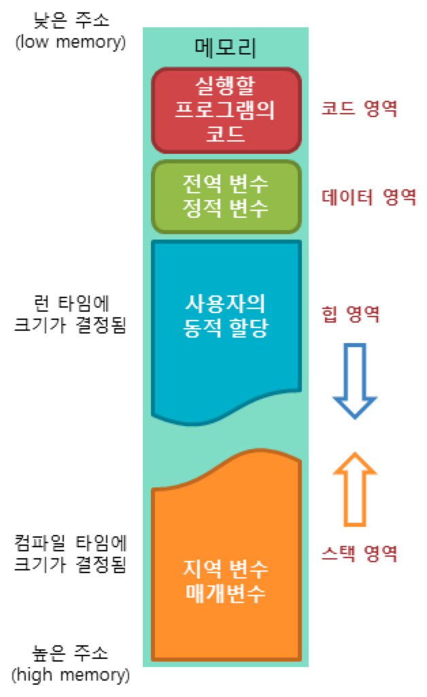

### Question 1:

Object-oriented programming uses classes and objects. What are classes and what are objects? What is the relationship between classes and objects?

Answer :
크게 나온 단어 3개를 먼저 정의해보자. 객체(Object), 클래스(class), 인스턴스(instance)
객체(Object)는 물리적, 추상적으로 존재하는 것중에서 자신의 속성을 가지고 있고, 다른것과 구별이 가능한것을 의미한다.

예를 들어 사람이라는 객체는 이름, 나이, 성별 들과 같은 속성과 먹다, 자다 와 같은 동작을 갖는다
여기에서 이름 나이같은 속성은 자바에서 field(변수)라 칭하고, 동작을 method라 칭한다.

클래스는 객체를 생성하기 위한 일종의 설계도이다. 흔히 클래스를 빵을 찍어내는 빵틀이라 칭하고,
찍어나온 객체를 빵이라고 한다. 클래스는 필드, 생성자, 메서드로 구성되어있음

인스턴스 클래스에서 찍어낸 빵들이다. 클래스 안에 필드가 선언되어있다면 이 인스턴스에도
그 필드가 존재한다.java 프로그램 실행 시 클래스는 jvm메모리의 클래스 영역에 로드되고,
이 클래스를 사용하여 힙 영역에 새로운 인스턴스를 생성할수 있다.

=== 힙 영역?
프로그램이 실행되기 위해서는 먼저 프로그램에 메모리에 로드(보조기억장치에서 주 기억장치로 끌어올리는 과정)되어있어야 하고,
프로그램에서 사용되는 변수들을 저장할 메모리도 필요하다. 따라서 컴퓨터의 운영체제는 프로그램의 실행을 위해 다양한 메모리공간을 쓴다

1. 코드 영역
코드영역은 실행할 프로그램의 코드가 저장되는 영역으로 텍스트영역이라고도 부른다. CPU는 코드 영역에 저장된
명령어를 하나씩 가져가서 처리한다.

2. 데이터 영역
데이터 영역은 프로그램의 전역변수와 정적변수가 저장되는 영역이다. *프로그램 시작과 함께 할당되며,
프로그램이 종료되면 소멸한다.*

3. 스택 영역은 함수의 호출과 관계되는 지역변수와 매개변수가 저장되는 영역, 함수가 호출되면 생기고, 호출 완료시 소멸한다.
스택영역은 PUSH 동작으로 데이터를 저장하고 POP 동작으로 데이터를 인출한다.
이러한 스택은 후입 선출 LIFO 동작이므로, 가장 늦게 들어온 데이터가 가장 먼저 인출된다.

4. 힙 영역
메모리의 힙 영역은 사용자가 직접 관리할수 있는, 그리고 해야만 하는 영역이다. 사용자에 의해 동적으로 할당되고 해제된다.

Question 2:

Explain carefully what null means in Java, and why this special value is necessary.

Answer:

    public class NullTest {
    int i;
    Integer ii;
    public static void main(String[] args) {
        NullTest t =new NullTest();
        System.out.println(t.i);
        System.out.println(t.ii);
    }
}

를 보면, int 는 primitive 고 Integer는 Reference type 이다. 인스턴스 타입으로 선언했기때문에
객체를 생성하는 즉시 초기화가 되었을것이고, 값을 확인해보면 int 는 0, integer는 null이다. primitive 타입은
초기값으로 0 이 들어간다. 왜? 영어번역 그대로 원시값을 자체적으로 저장하기 때문이다. 하지만 참조형의 경우
선언과 이니셜라이즈를 해줘야한다.

==== 왜 선언만 하면 안될까?
이유는 메모리를 잡아놓고, 메모리에서 뭘 가르키고 있을지 선언
하지 않았기 때문에 아무것도 가르키지 않는상태인것이다. 이건 0도 아니고 ""도 아니다. 저것도 원시형을 가르키고 있는
상태이지만 객체를 아무것도 가르키지 않아서 이것을 표현할 방법으로 null을 사용하는것이다.

Question 3:

What is a constructor? What is the purpose of a constructor in a class?

Answer:
생성자는 객체를 생성할때 해당 객체의 초기상태를 설정하기 위해 필요한것이다.이를 통해 우리는 인스턴스 변수의 초기화,
매개변수를 전달하는등, 생성할때의 초기값을 받아 객체의 초기상태를 입력하는데 사용된다.
인스턴스변수를 선언할때 초기화를 해줘도 되지만, 생성시 상태를 바꿔야 하는 경우나, 서브클래스 에서 상속을받아
슈퍼클래스의 생성자를 호출하는경우, 슈퍼클리스의 초기화를 진행할수있기 때문이다.

Question 4:

Suppose that Kumquat is the name of a class and that fruit is a variable of type Kumquat. What is the meaning of the statement "fruit = new Kumquat();"? That is, what does the computer do when it executes this statement? (Try to give a complete answer. The computer does several things.)

Answer :
선언하는 순간 컴퓨터는 메모리에 Kumquat을 위한 메모리공간을 할당하고, 이의 메모리 주소를 fruit라는 변수명에 저장한다. 쿰쾃의 생성자가
객체 내부의 인스턴스를 초기화하게 된다.

Question 5:

What is meant by the terms instance variable and instance method?

인스턴스 객체를 생성하고 객체 안에 존재하는 변수와 메서드를 의미한다. 생명 주기는 인스턴스 객체와 함께한다 힙영역에 저장

Question 6:

Explain what is meant by the terms subclass and superclass.

자바에서는 클래스가 클래스의 기능을 확장하여 사용할수 있는데 A클래스가 B 클래스의 기능을 확장하여 사용한다면
A extends B 라고 표현한다. B는 A의 기능을 확장하여 사용할수 있으며, B가 서브 A가 슈퍼클래스이다.

Question 7:

Modify the following class so that the two instance variables are private and there is a getter method and a setter method for each instance variable:

    public class Player {
        String name;
        int score;
        public String getName(){
            return this.name;
        }
        public void setName(String name){
            this.name = name;
        }
    }

Question 8:

Explain why the class Player that is defined in the previous question has an instance method named toString(), even though no definition of this method appears in the definition of the class.

Answer :
클래스를 선언할때 아무것도 상속받지 않는다고 선언하면, 이는 Object 클래스를 자동으로 extends 받은 상태이다.
default 클래스안의 필드값을 하나씩 출력해주고, 이의 형태를 바꾸고 싶다면 우리는 오버라이딩 해서 사용하면 된다.

Question 9:

Explain the term polymorphism.

Answer :
서로 다른 객체가 같은 메서드에 서로 다른 방식으로 작동하는 것을 의미한다. 이는 우리가 메서드를 재정의 할수 있기때문에 나타나는 것인데
우리가 클래스를 상속 받았다면, 클래스는 객체의 유형이 superclass 냐 subclass에 따라 같은 메서드여도 출력이 다르게 나올수 있다.

Question 10:

Java uses "garbage collection" for memory management. Explain what is meant here by garbage collection. What is the alternative to garbage collection?
가비지 콜렉터는 더이상 사용하지 않는 객체를 찾아내, 그 객체가 차지하는 메모리 공간을 회수하는 역할을 한다.

    Test a = new Test();
    Test b = new Test();
    a =  b;

이렇게 선언하면 a가 가르켜던 객체의 주소값은 어떻게 찾을까. 못찾는다. 이걸 찾아서 없애주는게 가비지 콜렉터이다.

Question 11:

What is an abstract class, and how can you recognize an abstract class in Java?

Answer :
추상 클래스란 객체를 선언만 할수 있고, 구현은 할수 없는 클래스를 말한다, 이를 abstract받는 서브클래스는 반드시 슈퍼클래스
에서 선언한 메소드를 구현해야 하는 의무가 있다. abstract로 해야함

Question 12:

What is this?

this는 자기자신을 가르키는 것이다. 예를들어 클래스 안에 인스턴스 변수와 로컬변수가 있을때
메서드 안에서 인스턴스 변수를 가르켜고 싶다면 우리는 this. 라는 문법으로 참조할수있다.

Question 13:

For this problem, you should write a very simple but complete class. The class represents a counter that counts 0, 1, 2, 3, 4, .... The name of the class should be Counter. It has one private instance variable representing the value of the counter. It has two instance methods: increment() adds one to the counter value, and getValue() returns the current counter value. Write a complete definition for the class, Counter.

Question 14:

This problem uses the Counter class from the previous question. The following program segment is meant to simulate tossing a coin 100 times. It should use two Counter objects, headCount and tailCount, to count the number of heads and the number of tails. Fill in the blanks so that it will do so:

    public class Count{
        private int count = 0;
        public void increment() {
            count++;
        }
        public int getCount() {
            return count;
        }
    }

Question 15:

Explain why it can never make sense to test "if (obj.equals(null))".

==는 주소값을 비교한다는 뜻이고, equals는 안에 데이터를 비교한다는 뜻인데, obj가 실제로 null이라면 데이터가 null 이라는 것이 아니라
주소값이 null이라는 뜻이다. 따라서 주소값을 비교하는 == 으로 비교하는것이 맞는 표현이다.